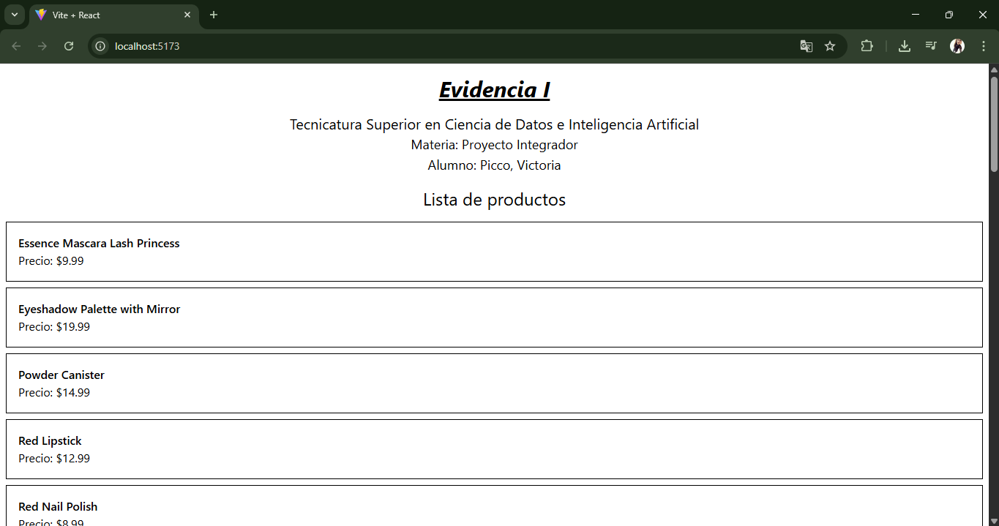

# Proyecto Integrador - Evidencia I

## Ejecución

1. Cloná el repositorio.
2. Abrí la terminal y ubicáte en la carpeta del proyecto.
3. Instalá las dependencias con:
    ```bash
    npm install
    ```
4. Iniciá el proyecto con:
    ```bash
    npm run dev
    ```

